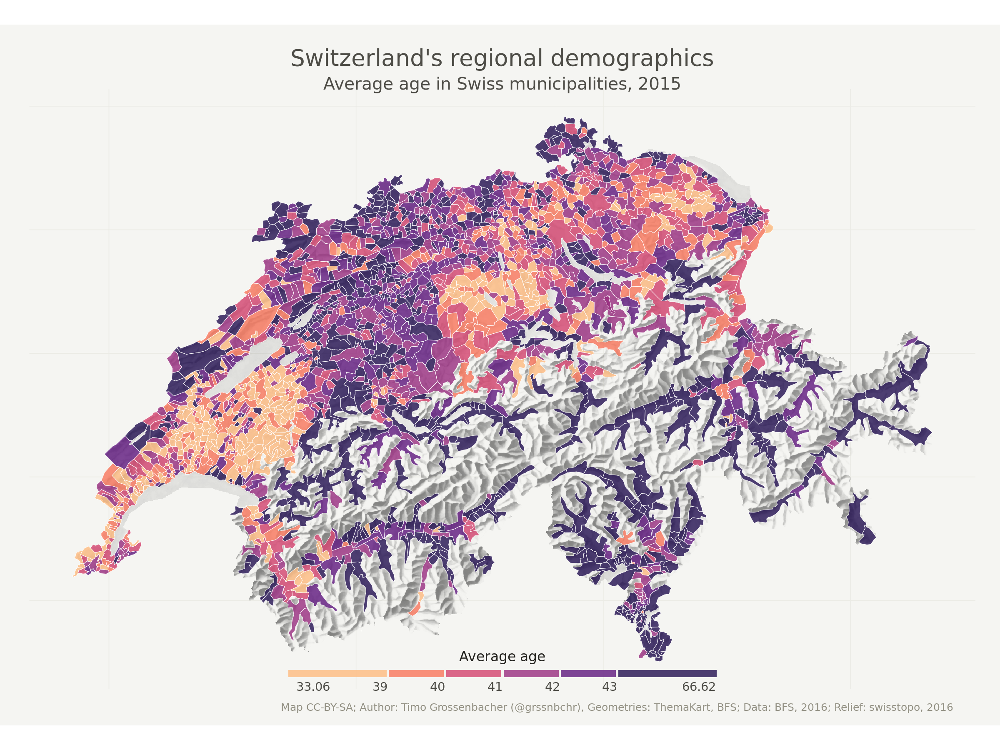

Beautiful thematic maps with ggplot2 (only)
===========================================

This is the code and data for [the blog post and tutorial on how to create such a map with R's `ggplot2` package only](https://timogrossenbacher.ch/2016/12/beautiful-thematic-maps-with-ggplot2-only). Instructions on how to use this can be found there.

Follow me on [Twitter](https://twitter.com/grssnbchr)! 

License concerning the code and the maps produced: **CC-BY-SA**.
Data licenses: See `index.md`.

